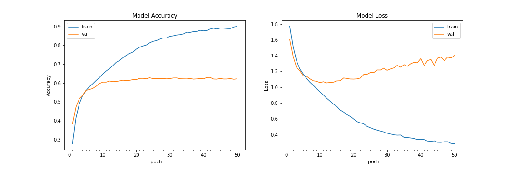

# Emotion Recognition 

### Install requirements 
```
pip3 install -r requirements.txt
```

### Database
```
https://www.kaggle.com/deadskull7/fer2013
```

### Model training

#### Best Model 


```
 model.add(Conv2D(32, kernel_size=(3, 3), activation='relu', input_shape=(48,48,1)))
 model.add(BatchNormalization())
 model.add(Conv2D(64, kernel_size=(3, 3), activation='relu'))
 model.add(BatchNormalization())
 model.add(MaxPooling2D(pool_size=(2, 2)))
 model.add(Dropout(0.25))

 model.add(Conv2D(128, kernel_size=(3, 3), activation='relu'))
 model.add(MaxPooling2D(pool_size=(2, 2)))
 model.add(Conv2D(128, kernel_size=(3, 3), activation='relu'))
 model.add(MaxPooling2D(pool_size=(2, 2)))
 model.add(Dropout(0.25))

 model.add(Flatten())
 model.add(Dense(1024, activation='relu'))
 model.add(Dropout(0.5))
 model.add(Dense(7, activation='softmax'))
```

